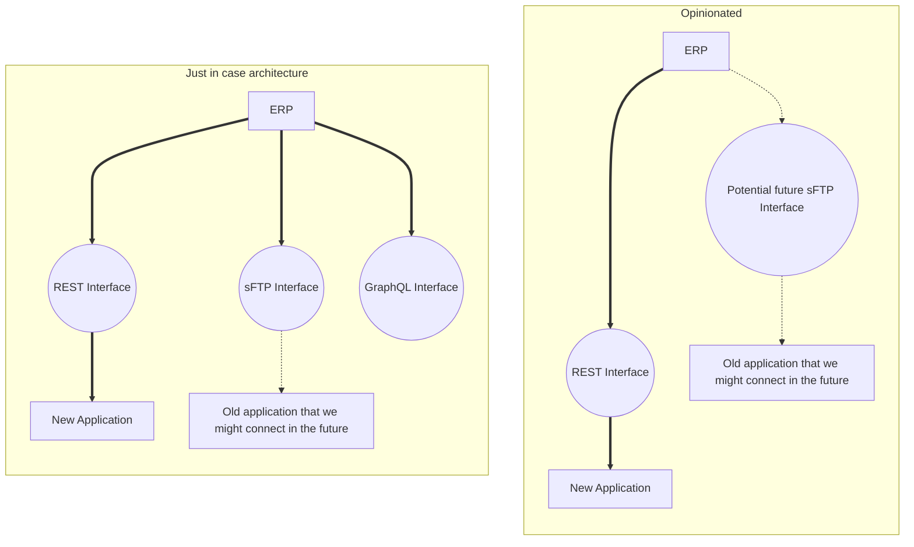
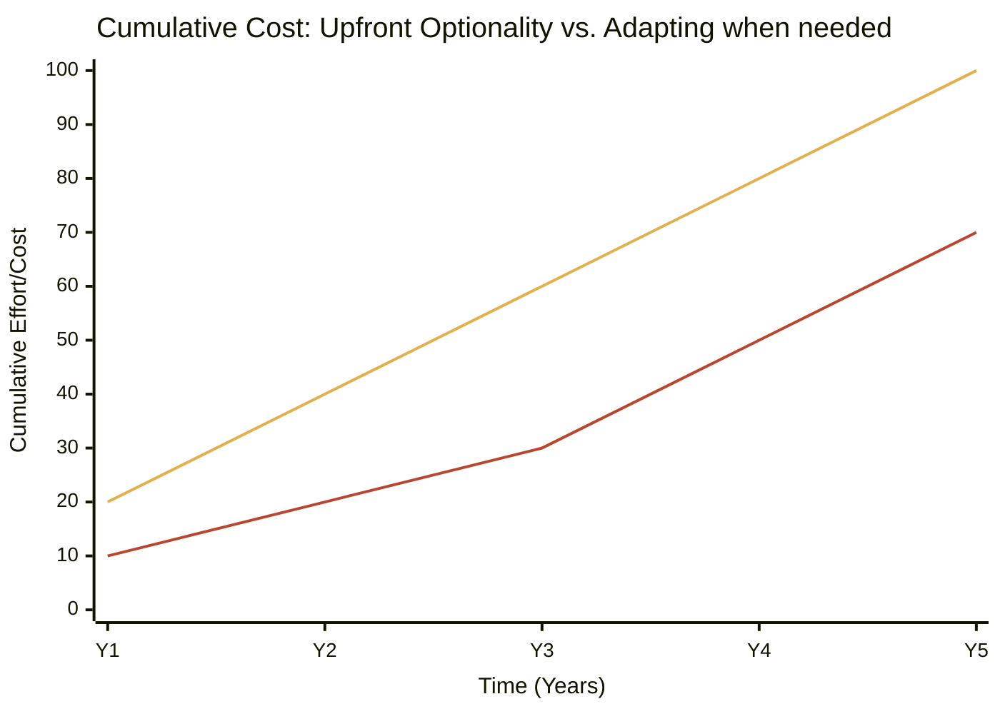

Before my end-of-year holiday break, I received an email [^1] from someone who read my post about “[Choosing your starting line in enterprise architecture](https://frederickvanbrabant.com/blog/2025-11-28-choosing-your-starting-line-in-enterprise-architecture/)”. Mark asked me what I meant by the line:

> So yes, you can map the AS-IS. You can design the TO-BE. You can even claim you’re doing both, which is the classic architect escape hatch.

And I had to be honest with him, it was mainly a throwaway joke poking fun at the fact that most architects when they get a question, the first thing they will answer is “it depends”.

But that mail exchange stuck a bit in my mind over the holiday break. Enterprise architecture claims to bring clarity, but often hides behind ambiguity. And maybe that’s something we need to confront.

## Borrowing YAGNI from the developer world

When I was a developer[^2], I was always attracted to highly opinionated libraries and frameworks. I always preferred a single way of doing things, over three different ways to do it, and they all have their pros and cons.

Even if that way of doing it was not how I would personally do it. I know that the person that made the library or framework thought about it deeply, came to the conclusion “this is best”, and fully supports and documents that single way.

It just makes the framework or library easier to talk about and understand.

This is part of the YAGNI (You ain't gonna need it)[^3] mindset. Don't start covering and building scenarios that might or might not actually happen in the future.

Translating the same ideas to enterprise architecture would be the typical preparations that we build into systems for future strategy. Building a new application has connections for data in the form of a REST API, but also building an optional sFTP part in case that you have to connect some legacy tool to it in the future.

That is very unopinionated software. How do you connect to this application? Ah, here are the options.

That sounds nice from a service point of view. But if everything is internal, that service that you provide to other applications is going to cost a lot of money in development and maintenance of these options. That lack of strategy at this level will also make your entire application landscape less coherent, as there is no unified way of working.

### “It depends” as architectural debt

Don't get me wrong, I'm not advocating here for abandoning backup plans and putting all your eggs in one basket. What I am advocating for is architectural courage.

Are all these “it depends” and “future-proofing” mantras there to get to a more correct solution, or just there to minimize your personal responsibility if it all goes haywire?

If it's the latter, you have to ask yourself what the value of that architecture really is. If the business leans on your expertise to set up a project and for every decision you have you just cover all options, there is no real point in your expertise. You are just another meeting and checkbox in an approval process.

You also have to calculate the cost of it all. In the above senario where you cover all your bases and build a REST API and an sFTP connection because "you might need it in the future", you will have to maintain, secure, document, train and test both. For years to come. Just another think that can break.

That would be ok if that senario actually plays out. If the company strategy changes, and the company never connects the two applications, all of that has been for nothing.

In the case of not optimizing ahead of time for that senario (but still keeping it in the back of your mind). You can just implement it when it's actually needed. There will be a lower cost, the company will have appetite for the change, and you might have a clearer view of the actual data that will flow over the connection.

## The myth of “easy swapping”

Then there is the conversation of the easy-off ramp in implementing new software.

When implementing new applications, you already prepare for ways to off-board the application by making your systems hot-swappable or technologically agnostic. Even going as far as having applications that can use whatever data-provider or environment.

A lot of architects will tell you that's an essential part of architecture.

You can do these things with enterprise-service-buses and interfaces or gateways, maybe even front-loaded microservice middleware. There are more technological options than you can imagine, and all of these are great conference talks.

The problem is, like in all nifty architectural setups, the actual users. It's cool that you can hot swap your incoming data from one service to a different one in less than a week! Now we just need six months of new training, new processes, new KPIs, new goal setting and hiring to use said new data source.

Technology can be made swappable, but organizations almost never are.

Besides that, how often have you actually ever swapped a database in a system? I know ORMs are great, but the entire claim that you can swap back and forward from MySQL to MongoDB has always been a moot point to me. You build applications with a certain flavour of data storage in mind, why would you suddenly want to change over to a total different flavour?

Please remember that you can always change setups in the future. That is part of the entire agile way of working that companies like to talk about.

### Choosing a side

I’m not suggesting we should all become architectural "dictators" who refuse to listen to edge cases. But I am suggesting that we stop being so deep into "what-if" and start focusing more on "what-is."

The next time you’re sitting in a design session and that familiar urge to build a "just-in-case" abstraction layer hits you, pause. Ask yourself: am I building this because the business needs it, or because I’m afraid of being wrong?

Being opinionated doesn’t mean being rigid, it's more about actually having a plan. It means having the courage to say, "This is the path we are taking because it is the most efficient one for today." If the strategy changes in two years, you deal with it then, with the benefit of two years of lower maintenance costs and a leaner system.

And the thing we often forget is that the business hates all of these "what if" senario's, they just don't care about it. They mainly want it to work. If your "opinionated" choice needs to change later, they won't remember the technical specifics of why you didn't build three different API types. They’ll remember that you got the project live on time and it worked when they needed it.

So, let’s stop taking the escape hatch of "it depends." Pick a lane, document it well, and build it simply. I promise, the sky won’t fall—and your application landscape (and your sanity) will thank you for it.

[^1]: I have a contact page. This is the first mail I've ever got from that contact page. If you would like to know more or have comments on something I write, you're always welcome to drop me a message.

[^2]: There days I only code as a hobby.

[^3]: YAGNI goes further than that, I know
