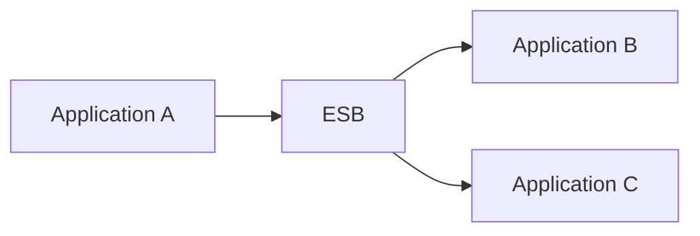
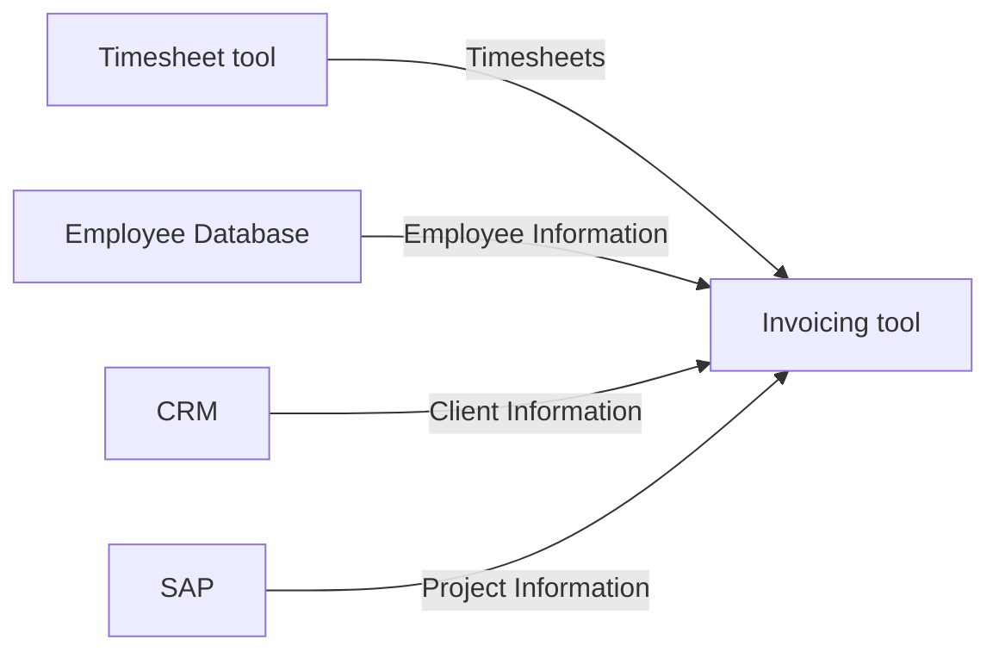
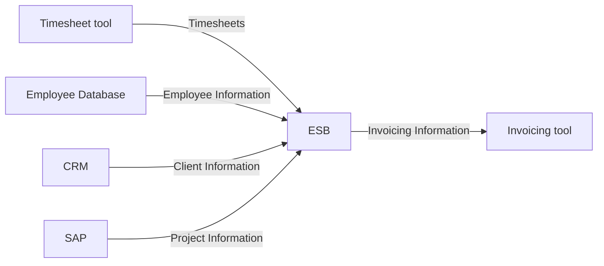
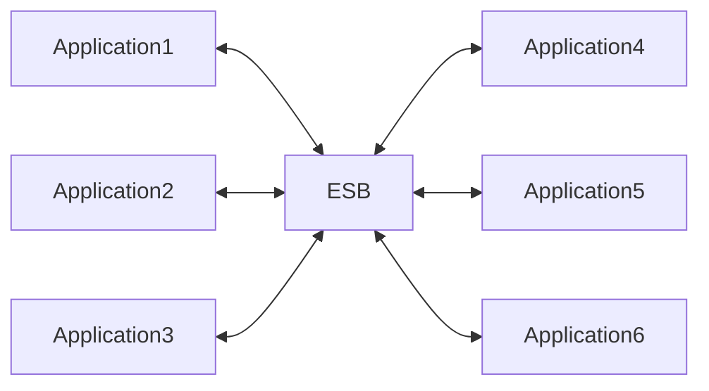
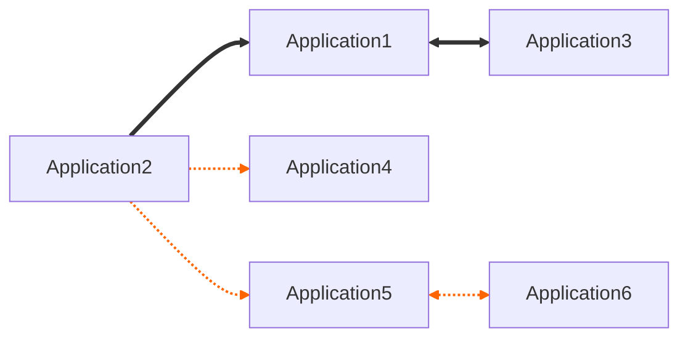

Every six months or so I read a post on sites like Hackernews that the enterprise service bus concept is dead and that it was a horrible concept to begin with. Yet I personally have great experiences with them, even in large, messy enterprise landscapes.

I would go even further and say that I see a resurgence in their usage in big enterprises. Even companies that moved away from them seem to have a renewed appetite. Sometimes they are rebranded as integration platforms / iPaaS, but they are still very much the thing under the hood.

This seems like the perfect opportunity to write an article about what they are, how to use them and what the pitfalls are. From an enterprise architecture point of view that is, I'll leave the integration architecture to others.

Enterprise service buses can do very technical things, but that is not what I want to focus on today. I know there are real upsides (and downsides) to the translation layers in these tools (for example), but today we want to focus on what the business value is of using an ESB.

## What is an ESB

When people ask me what an enterprise service bus (ESB) is, I like to use an airport metaphor.

You can see an ESB as an airport hub, specifically one for connecting flights. An airplane comes in, drops their passengers, they sometimes have to pass security, and they go on another flight to their final destination.

Most people like to have a direct flight, but from an organizational point of view it makes sense to have a lay-over. You can bring people from New-York to London, and then plan flights from London to places in Europe. Not everyone from the original flight in New-York wants to go to Milan, but other people from other flights might want to.

So what does that all mean in a technical sense?

An ESB is a mediation layer that can do routing, transformation, orchestration, and queuing. And, more importantly, centralizes responsibility for these concerns.

In a very basic sense you connect application A to one end of the ESB, and application B & C the other. And you only have to worry about those connections from and to the ESB.

## The big upsides for the organization

With the basics out of the way, let's focus on these other aspects. But let's focus on them from an organizational point of view.

### Decoupling at the edges

Say you want to replace an invoicing tool. This is probably not a small operation. You will have to see what processes run in this tool, what data supports these processes, and how to get them. Once you have all that, you will have to make a gap analysis versus the new tool. This will include work on all the applications that feed the invoicing tool this data.

Now if you were to have an ESB in place for this, you would only have to focus on the ESB to Invoicing tool part.

Now we have to focus on what the new invoicing tool needs in terms of information. If it's the same, but with different field names, that is all handled in the ESB, and we would not have to touch the other applications. This drastically reduces the blast radius of change.

If we require extra information, we would still have to touch the connections going to the ESB, but it would be to add fields. We don't have to worry about REST vs SOAP vs FTP stuff.

### Centralized integration control

An ESB can also give you more control over these connections. Say your ordering tool suddenly gets hammered by a sale. The website might keep up, but your legacy orders tool might not.

Situations like this break down at the weakest link. You can work around that with smart architecture, but you don't always have control over that with SaaS or legacy tooling.

Here again with an ESB in the middle you can queue these calls. Say everything keeps up, but the legacy mail system can't handle the load. No problem, we keep the connections in a queue, they are not lost, and we throttle them. Instead of a fire hose of non-stop requests, the tool now gets 1 request a second.

That is not ideal from a product point of view, people have to maybe wait 10 minutes for their order confirmation, but the sales went through. The people will get their product they bought, and you don't have the awkward conversation with the leadership about how we lost a bunch of money from lost sales from the system now keeping up.

This is about absorbing variability at the platform level instead of the application level.

### Operational visibility

If, in theory, all connections go over the ESB [^1] you can also keep an eye on all information that flows through it. Especially for an enterprise architect that's a very nice thing.

You can have with little effort an overview of everything that is connected and what data flows over it. That also means that you can have a very knowledgeable integrations team.

Also from a security point of view this is a big win. You have an overview of all connections and what they all use as standards, a perfect starting (and tracking) point to modernize them. Without messing up all the other connections.

## But that is all in theory

All of those upsides are very true. But that's only the case if you go all in and are very strict in how to use them. And that's where a lot of the bad experiences come up.

### Hidden business logic

Take for example that translation layer. Your source has a `firstName` and a `lastName` field, but your sink only accepts a `Name` field. OK, no problem `name = concat(firstName, ' ', lastName)`. No harm done.

But then for American users it needs to be with middle names. So we might get an `if/else` in there. And then for Asian users it's last name and then first name. That `if/else` is now a `switch`.

Before you know it you are writing business critical logic in a text-box of an integration layer. No testing, no documentation, no source control …

In reality, you’ve now created a shadow domain model inside the ESB.

This is often the core of all those “ESBs are dead” posts.

### Tight coupling disguised as loose coupling

Yes you can plug and play connections, but everything is still concentrated in the ESB. That means that if the ESB is slow, everything is slow. And that is nothing compared to the scenario where it's down.

You are also putting all your eggs in the same basket for vendor lock in. If you have a few hundred applications connected to this central platform, what are you going to do when they hike the price 50%? Decoupling all of these applications away from this central layer is going to be a momentous undertaking.

You could always build one yourself, but that is again a team that needs to exist and building an ESB from scratch is a huge undertaking[^2]. Not something I would recommend for non-tech companies.

If you are not explicitly willing to run an integration platform as a product, you probably shouldn’t build one.

### Skill bottlenecks

You can always train people into ESB software, and it's not necessarily the most complex material in the world (depends on how you use it), but it is a different role. One that you are going to have to go to the market for to fill. At least when you are starting to set it up, you don't want someone who's never done it to “give it a try” with the core nervous system of your application portfolio.

If you compare it to point-to-point connections, those are done by software developers. Be it Java, .net, JavaScript,... profiles. You already have those, and they can jump in from another team if there is a time crunch[^3].

### Cost

It goes without saying that you pay for this service. Some companies charge per connection, others per data usage. There are different cost strategies.

This is an extra cost you would not have when you do point-to-point. The promise is naturally that you retrieve that cost by having simpler projects and integrations. But that is something you will have to calculate for the organization.

## Modelling an enterprise service bus

Now how do you include this in our meta-model. This is actually also a discussion point. Is this an application or a platform or a system? My suggestion is (like in the case of Entra/active directory), map it to your connections. Let me explain.

If you map your ESB as an application you will quickly run into this diagram. Everything is connected to the ESB, and every connection goes out of the ESB. It's impossible to track what actually goes where.

You could argue that that's not an issue, as you can indeed connect everything in the ESB and see it as a data source. But the value of your diagramming will be useless then.

ESBs collapse many architectural concerns into a single box, which breaks most modelling conventions.

What I like to do is (and most EA tooling allows that) is to add parameters to the connections. One of these parameters is the type of connection[^4]. I then colour code these connections. For example, all orange connections are ESB connections.

But that all depends on the type of diagram you want to create.

## When to use an ESB

Enterprise service buses only make sense in big organizations (hence the name). But even there is no guarantee that they will always fit.

I would only really advise using them if your application portfolio is relatively large and is changing often. They also mainly shine when there is a mixture of SaaS, legacy, and more modern in house applications.

If your portfolio is full of homemade custom applications I would maybe skip this setup. You have the developers, use the flexibility you have.

There is also the funding aspect; these setups add another cost that is not always clear at the beginning for most organizations (if you pay per MB, it can be really hard to grasp how much GB you are shipping over these connections).

So yes, I'm sure I'll read another post on Reddit in a few months about how enterprise service buses are a thing everyone should avoid, and everyone is going to be sharing their horror stories in the comment section (some of these are pretty good). But I'm sure I'll be seeing ESBs for years to come at all big organizations. Even if it has a new name or logo this time around.

[^1]: You don't want that in practice. There is latency, cost and just overhead involved. More on that in the Downside section

[^2]:
    If you want to tackle this, make sure to have a clear outline on how to build it. I would recommend looking into:

    - Pipes and Filters Pattern
    - Strategy Pattern
    - Provider Pattern
    - Registry Pattern

[^3]: compared to having to learn an entire new role

[^4]: I also do this for FTP, REST, SOAP,...
