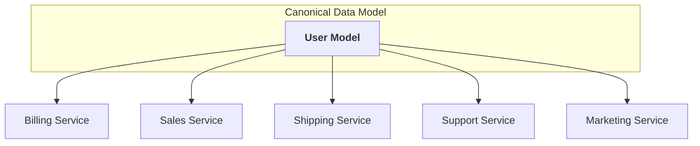
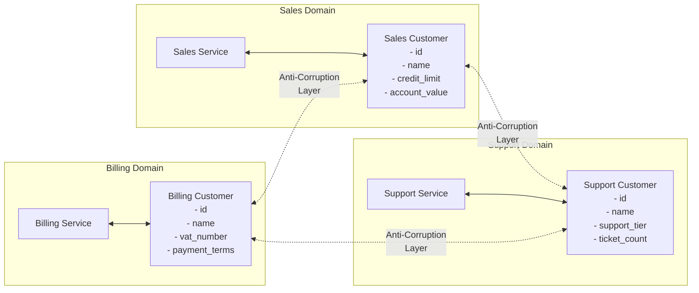
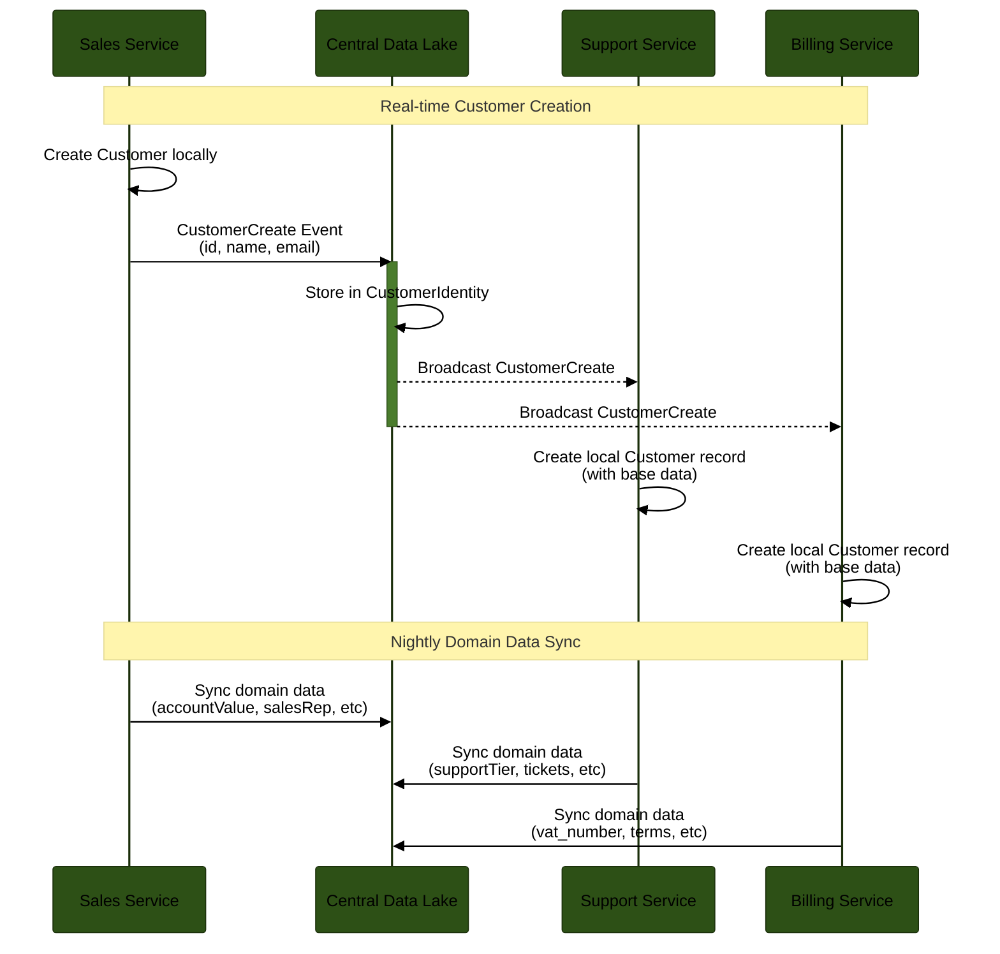
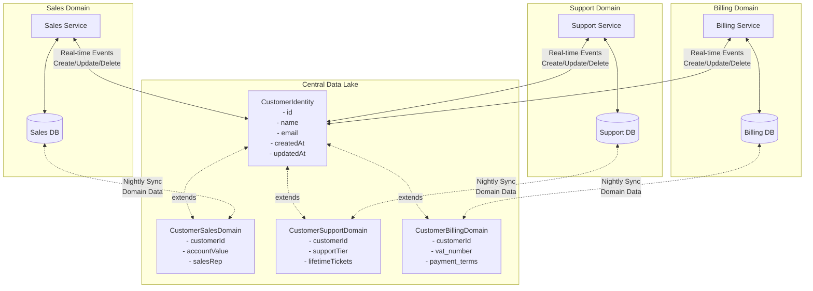

Some years ago I worked with a scale-up that was really focused on the way they handled data in their product. They extensively argued over data language, had value objects everywhere, explicit models and, even hexagonal architecture.

It was a cool place to work, with a lot of smart people.

At some point they started to talk about standardizing their data transfer objects, the data that flows over the API connections, in these common models. The idea was that there would be a single Invoice, User, Customer concept that they can document, standardize and share over their entire application landscape.

Everyone had the same idea of what a user was, from database engineer all the way to the sales people. They called it unambiguous language.[^1]

## The Canonical Data Model

What they were inventing is now known as a Canonical Data Model. A centralized data model that you reuse for everything. And to be fair to that team, there are companies that make this work. Especially in highly regulated environments you can see this in play for some objects. In banks or medical companies it's not uncommon to have data contracts that need to encapsulate a ledger or medical checks.

It also brings other upsides, regarding onboarding and integrations it's rather sweet. The Payroll team needs the customer data, everyone knows exactly what they can expect and what they need to send.



The problem is, however, that it's a horrible setup.

## Bounded context

When that team was often talking about domain driven design concepts (value objects, unambiguous language) they seemed to miss the domain part. More specifically, the bounded context.

The bounded context is the lens you use to look at a concept. Let me explain in the most technical way possible, with a JSON object.

Say you want to kickstart the idea of a CDM as someone working in the domain of billing, and you propose your Customer object. [^2]

```JSON
{
	"id": "40bb524a-3e0e-4a4a-93df-399819b3fd68",
	"name": "Acme Corp",
	"vat_number": "BE0123456789",
}
```

Now you get some people from the other departments together and ask them, what do you think?

After a few workshops your Customer object is now:

```JSON
{
	"id": "40bb524a-3e0e-4a4a-93df-399819b3fd68",
	"name": "Acme Corp",
	"vat_number": "BE0123456789", // Billing needs this
	"credit_limit": 50000.00, // Sales needs this
	"delivery_instructions": "Back door", // Shipping needs this
	"support_tier": "Gold", // Support needs this
	"marketing_opt_in": true, // Marketing needs this
	"last_invoice_date": "2024-01-01", // Data is leaking
	"crm_lead_source": "Conference" // Why is this in the Shipping app?
}
```

_Congratulations, you’ve just built a God Object._

A customer can mean a lot of things to a lot of different people. This is the bounded context. For a sales person a customer is a person that buys things, for a support person they are a person that needs help. They both have different lenses.

Now if we keep following the Canonical Data Model, this Customer object will keep on growing. Every week there will be a committee that decides what fields need to be added (you cannot remove fields as that impacts your applications).

In the end you have a model that nobody owns, has too much information for everyone and requires constant updating.

## Enter the Data Mesh

A way to solve this, is data mesh. This takes the concept of bounded context as a core principle.

In the context of this discussion, data mesh sees data as a product. A product that is maintained by the people in the domain. That means that a customer in the Billing domain only maintains and focuses on the Billing domain logic in the customer concept.

They are responsible for the quality and contract but not for the representation. That means in practice that they can decide how a VAT number is structured. But not how the Sales team needs to format said model. They have no control or interest in how other domains use the data.

How we do this is through a concept called anti-corruption layers. These are transformation layers at the outside of your domain that transform incoming and outgoing data into/out of domain models.

So the data mesh connects small fiefdoms, each owning and shaping the data relevant to their domain.



It's a very flexible design but while Data Mesh solves the coupling problem, it introduces a new set of challenges.

If I’m an analyst trying to find 'Customer Revenue,' do I look in Sales, Billing, or Marketing? The answer is usually 'all of the above.' In a pure Mesh, you don't make multiple calls, you have to build multiple Anti-Corruption Layers just to get a simple report. It requires a high level of architectural maturity and that is something not every low-code or legacy team possesses.

You also need a very capable team, not only from a technical point of view, but also from an architectural point of view. All of your teams need to be very aware, and willing, to fully commit to this setup. That includes low-code and legacy teams.

And what about SaaS and 3rd party? Sure, you can abstract that. Something you also have to do with the CDM, but it's again more infrastructure.

I'm also not sure about the data and analytics teams. They now have a ton of overhead.

## Federated Hub-and-Spoke Data Strategy

Let's try and see if we can combine these two strategies. On one hand we want a clear data setup that is discoverable, reportable, and has easy integration. On the other hand we don't want the huge model overhead, slow design committee, and data quality.

Big enterprises have Data lakes/Data lake houses. They are mainly hosted in tools like MS Fabric, Databricks, Snowflake, … Data scientists love these tools. These days these tools come battery included. They have out of the box APIs, transformers, notebooks, serverless code, ...

What if we leverage that setup? We centralize our data in a central lake. Yes, that is back to the CDM setup. But we split it up in federated domains. You have a base Customer table that you call CustomerIdentity that is connected to a SalesCustomer, SupportCustomer, ... Think of this as logical inheritance, a 'CustomerIdentity' record that is extended by domain-specific tables through a shared primary key.

```SQL
-- Central Lake
CustomerIdentity { id, name, email, createdAt, updatedAt, createdBy }

CustomerSalesDomain { customerId, accountValue, salesRep, ... }
CustomerSupportDomain { customerId, supportTier, lifetimeTickets, ... }
```

When you create a new Customer in your sales tool you trigger an event. The CustomerCreate event[^4]. The CustomerCreate trigger fills out the base information for the Customer (username, firstName, lastName) in the central data lake, at the same time we store our customer (base and domain specific data) in our local database. You also do this for delete and update events. The base information goes to the server, the domain specific data stays on the sales tool as a single source of truth.

The CustomerCreate event (or update/delete) also triggers all the other tools that are subscribed to that event. That being tools with Customers.

Every night there is a sync of the domain tools to the central lake to fill out the domain tables with a delta. Please note that the Lake is not the single source of truth here. It might be for the CustomerIdentity, but not for the domain data.





Now if we have a call from the sales tool to the Support tool, you only send over the base customer data[^3]. And the Support tool enriches that base data with their own specific domain data.

We don't do this for only the Customer data. You'll want to do this for all shared data.

## Consuming data without breaking domains

This is not a simple setup, I'm very aware of that. I would not propose it if I didn't see some big pro's.

### Upsides

First up is that you have a central data record that is at most a day old. That sounds a lot in development terms, but is very doable from a data and analytics point of view. If you really need to, you can always tweak the events.

Governance tooling (Purview, Atlan) works well with centralized lakes. Data retention, GDPR, data sensitivity are big things in enterprises. We can all fully utilize these and sync them downstream.

The domain owns the domain data. We support the bounded context approach while still making the data discoverable and traceable outside the IT department.

This supports Legacy, SaaS, Serverless, and Low Code applications. You will not hook them up to the event chain, but you can connect to the central data lake. They almost always support GraphQL. I'm personally not a fan of GraphQL, but I do see a good case here.

The payloads are very controllable. We don't send over these massive objects. But we are still able to fully migrate the data from the central place.

We have separation of concerns. Our domains focus on transactions (OLTP) and our lake focuses on analytics (OLAP).

### Downsides

That CustomerIdentity base table needs to be very lean. You might run back into discussions about adding fields. This will require discipline, but it's way easier compared to the CDM version. Domains can duplicate common fields (FAX in Sales AND Shipping). Not an issue, storage is cheap.

You will have to avoid the best category of bugs: racing conditions. Yes that's an issue. We have been writing and dealing with them since the first computer systems. Stick to good practices, and it's not the death sentence everyone always claims it is. [^4].

These nightly syncs need to be thought out, especially if you are in multiple (all?) timezones. This is something you can fix with queues. You're using them anyway for your events.

## Data architecture is very personal

Please don't go out there and implement this like I've written it out. This is not a one-size-fits-all approach. This post is more to give you an insight in a possible architecture.

There is so much more to really dig in into this approach. But for now it can just be a nice thought experiment and maybe part of this can be somewhere in your toolbox for when you might ever need it.

[^1]: If you're into DDD you might have a lot of opinions at this point, no worries, we'll get there.

[^2]: You also want an address, but that will greatly muddy the waters for this example

[^3]: You could only send over the customerID, but then you have an extra call each time

[^4]: Very important here is to use all the best practices of events. Most important is datastamps, Idempotent event handlers, and rollbacks
