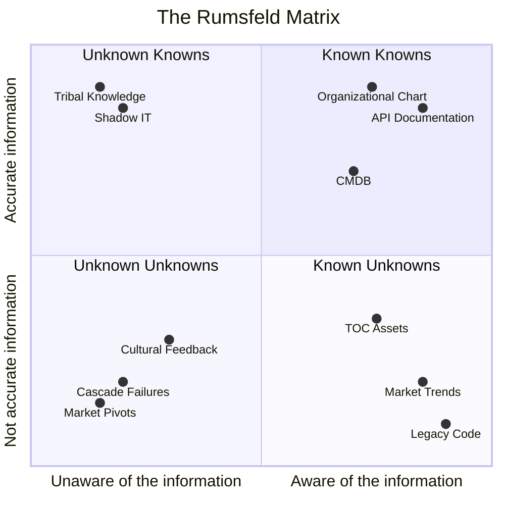
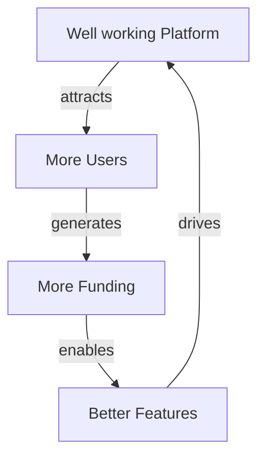
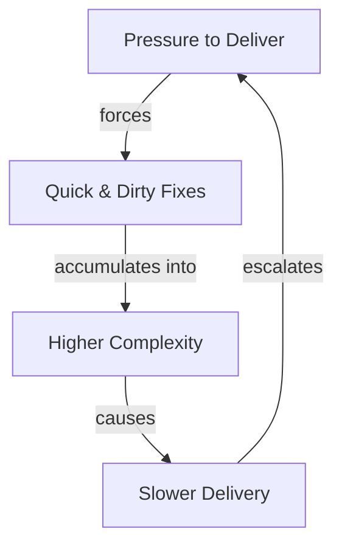
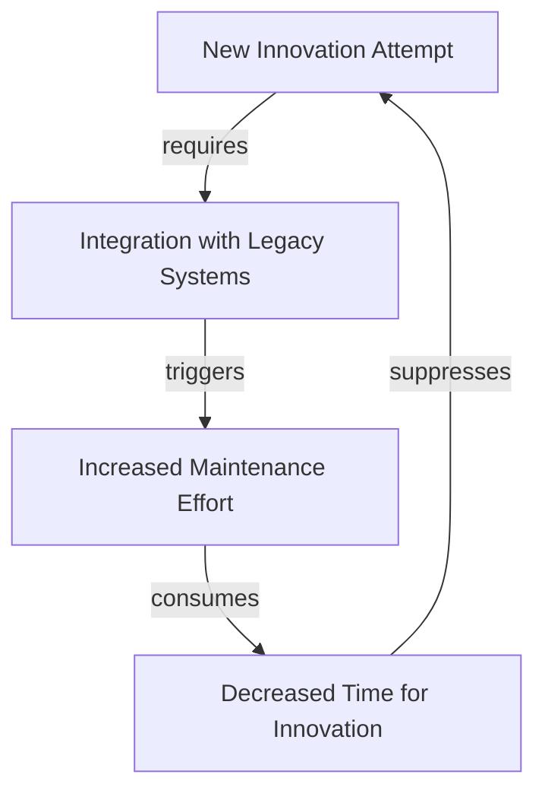

I first learned of systems thinking in the domain of city planning, and that is apparently also where the idea comes from. It was described to me in the context of building new residential buildings and effects on local bird populations.

Birds don’t always perceive glass clearly, especially when it's a tall apartment building and on their flight path. So there are birds that think they can pass under an arch, yet instead fly straight into a glass wall.

However, some of these buildings are also perfectly suited for nesting and resting places.

Now, I'm sure there are some meetings that architects and city planners have on the impact of their design on the local bird population. It's probably not their clients first item on the list in ordering new buildings and spaces.

Another example is adding trees to streets to lower city temperature[^1]. A lower temperature in a greener city might have an impact on the sale of beverages in the local cafés.

All of these things are nearly impossible to map. It's too complicated a problem[^2]. The same is true for organizations and enterprise architecture. Yet it's an enterprise architect's job to map out an organization.

## The Rumsfeld Matrix

In strategic planning there is a framework called the Rumsfeld Matrix. It's attributed to Donald Rumsfeld, yes, _that_, Donald Rumsfeld. But in reality it's an older concept that was used before in the late 1960s.

The idea of the matrix is that you map out what you know and what you don't know. That sounds very contradictory, how can you know what you don't know, but you abstract it. We do this to ground ourselves and don't lose the plot while we are setting up a strategy.

Every matrix has four quadrants, here it's no different, and in this case they are:

### The Known Knowns

This is what we know and what we have mapped. We have a full view of where we can find the data, what it looks like, how it arrived there, and how we can use it.

This makes up most of the diagrams an Enterprise Architect makes. Examples here are the CMDB, API documentation, Organizational charts …

### The Known Unknowns

You always have a list of things you want to map out, but haven't got around to yet. Think about a backlog of technical debt, or business processes that aren't mapped out yet, but you vaguely know what they do. You know where you can go look for them and how you could use the information, you just don't know the actual data itself. This also includes information that is too simplified to fully make use of.

### The Unknown Knowns

Here we have the information that the “system” knows, but you don't. Categorized here is shadow IT for example, or a weird workflow the COBOL developer uses in some legacy system to make sure the accounts work.

The system performs the task, but the documentation (and the architect) is unaware of how.

These are often rabbit holes that come on your path when you are looking into systems. The skeletons in the closet.

### The Unknown Unknowns

Now we have the examples from the intro. Emerging situations that happen when two unrelated systems interact for the first time. Things that are typically results of factors way too complicated to actually map.

## Causal Loop Diagrams

Remember in the intro that I said it's impossible to map out an Unknown Unknown? Well you kind of can.

Not in advance, mind you, more in a post-mortem sense.

The concept here is that you go over the events that took place like a script of a movie. Situation per situation. Then later when you have mapped that out, it could function as lessons learned for future strategic decisions.

In general, you have two kinds of loops.

### Reinforcing Loops

You can see them as snowball effects, they amplify themselves. Both negatively and positively.

You can have a “success to the successful” loop where positive change is reinforced by more positive change:

But there is also the “death spiral” where the opposite is true:

### Balancing Loops

These loops seek stability or a target. They resist change, which is often why digital transformations fail. Death spirals are definitely something to avoid, but this status quo can be just as detrimental to your organization.

An example here is the typical modernization project:

## A map is not the territory

I really like that quote. It's not mine, it's [Alfred Korzybski](https://en.wikipedia.org/wiki/Alfred_Korzybski). A diagram or map is only a representation of what you actually put on there. An abstraction. Even with the most detailed map in the world, you will still only show what you know.

And that's a good thing.

What I'm saying is that the goal shouldn't be to map out all the things[^3]. There is no way you're going to be able to do that. You should focus on the things that give value and make abstractions when there is no clear value.

I'm not convinced Causal Loop Diagrams actually are all that useful as the parameters of your strategy will always keep changing, and even in the case of these diagrams you are making assumptions and abstractions.

It is however very important to be mindful that there are a lot of things happening in an organization that you cannot be aware of. And shouldn't be aware of. This keeps you out of the false sense of knowledge when making strategy.

PS: as a reader exercise I challenge you to think where AI agents and LLM's are located in the matrix. Is an LLM a 'Known Unknown' (we know it's there but don't know what it will output) or an 'Unknown UnKnown' (It's a black box, and we have no real way to look inside)? I'll leave that to your next architecture review meeting.

[^1]: https://stories.kuleuven.be/en/stories/cooler-city-greener-city

[^2]: https://frederickvanbrabant.com/blog/2025-01-17-turning-complexity-into-manageable-complication/

[^3]: https://frederickvanbrabant.com/blog/2025-02-21-mapping-out-an-organization-is-a-massive-task/
