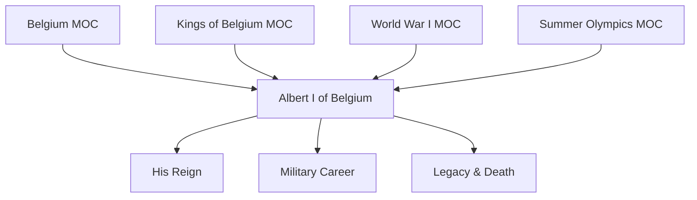
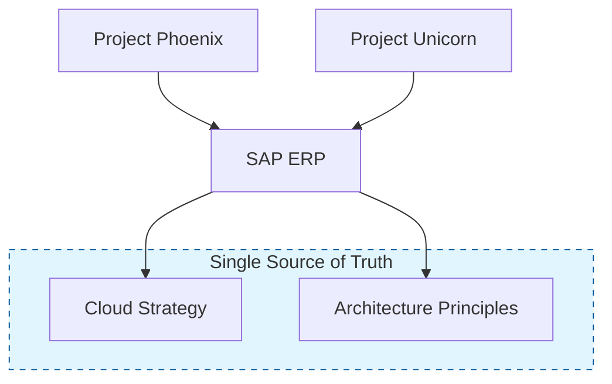
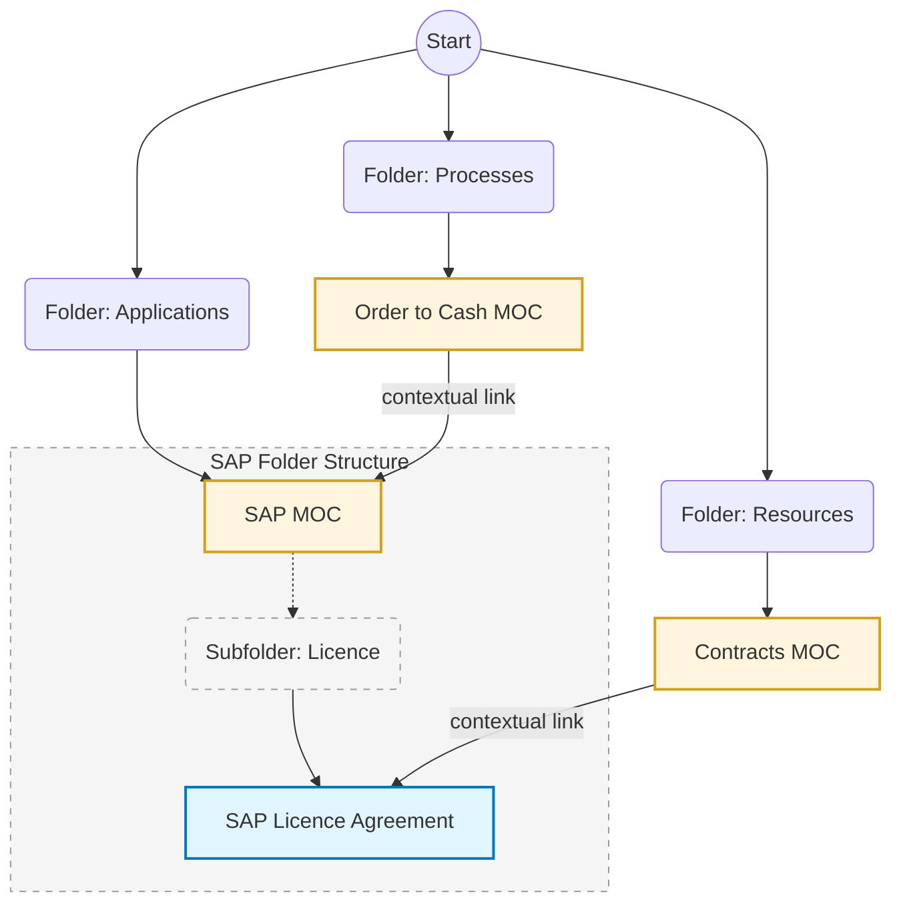

If you’ve known me for long enough, there will be a point where I'm going to pitch you the concept of [Obsidian](https://obsidian.md/). I adore that program[^1], I basically live my life in it. Everything is connected, and ideas just bubble up on their own.

That love for Obsidian is always amplified when I have to look up something on an organisational documentation platform. I can never find anything, it's always out of date, and it has conflicting ideas all over the place. I'm pretty sure you can relate (if you even have one).

Using applications like Obsidian for organisations is not workable, they aren't built for multi-user collaboration; it's not their product focus. And the applications I come across in organisations are also not bad. Tools like Confluence, Notion, Slite, and even things like SharePoint sites are not the problem. They are good tools.

The issue is the way they are set up. An endless, mindless dump of folders with duplicate and contradictory explanations, sometimes even just a PowerPoint slide deck that might or might not be relevant.

And I'm always amazed about the lack of strategy in setting something like this up. How is it that I can find where the third King of the Belgians was born in a few clicks yet finding out what our expense policy is about is something you would rather ask a colleague, then look for on the organisational wiki?

I've done a lot of research about this over the years, and I would like to share my ideas on how to set up a documentation store.

This is going to be a two part post. The first one is the general outline and philosophy. The second part is about structuring project governance documentation.

## The knowledge graph

A lot of organisational wikis are stored in folder structures. Something like this:

```
IT Department General
  ↳ 00_2025 Archives
  ↳ 01_Projects
	  ↳ Project Phoenix Redesign
	    ↳ Architecture
	    ↳ Data
  ↳ 02_Governance and Compliance
	  ↳ Move to cloud
	    ↳ Cloud_Usage_Policy_2026.pdf
	    ↳ License_Agreement.pdf
```

This mimics a file system and in the case of SharePoint is also often just a copy and paste from one. A bit of a dumping ground where you work from a file folder and try not to go out of it. Everything is trapped in its own container.

The idea of a knowledge graph goes in the opposite direction. In its rawest form, you do away with folders and structure altogether (we are not going to do that, but it makes the concept easier to introduce).

Wikipedia is actually a nice example of this. If you want to find the third king of the Belgians ([Albert I](https://en.wikipedia.org/wiki/Albert_I_of_Belgium)) you could go to the “Belgium” page and find a link there to said king. But you could also go through the page of past kings, or even the “Summer Olympic Games” main page.

That’s the beautiful concept behind Knowledge Graphs, they create organic links with relevant information without the need for you to set it up.

You know, the way the internet works.

## The MOC: The Map of Content

In this state it's very chaotic. It would be a huge list of coupled documents, but you'd still have a hard time actually finding what you'd need.

That's where **MOC**'s (**M**ap **o**f **C**ontent) come in. These are landing pages that help you on your way. Again, very much like Wikipedia. To go to a topic you go to one of the main ideas of the topic, and it will guide you there.

Belgium could be a MOC for guiding you towards its old kings, but so could World War I.

These pages can also include information themselves to introduce you towards the bigger concept. A MOC of Belgium would not direct you to a Belgium detail page, it would serve as both the main topic and the launch pad towards the deeper topics.



## Atomic Documentation

The problem, however, is that your organisation is not going to have the thousands of maintainers that a place like Wikipedia has. So we are going to have to deviate slightly from how Wikipedia does things[^2].

The issue with long articles is that not a lot of people find the motivation to write them. It takes a lot of work to write a decent long explanation of a concept[^3].

It’s also a bit daunting to jump into a very long article and read the entire thing when you are actually just in need for a small part of the information.

There is also the point of keeping this up to date. If you keep explaining the full concept of how your cloud strategy works on multiple pages, you're going to have to rework (and search) for all of these references every time the strategy changes. A classic example here is the architecture principles rewritten in every project.

This is where Atomic Documentation comes in: one concept per page. Reference the rest.

We borrow some concepts from the software development world:

- Single Source of Truth: If a Business Capability is defined once, it should be referenced everywhere, never re-typed.
- Transclusion: Confluence is pretty good at this for example. You can embed parts of a different document in the current document. I often find it better to just link, but the concept is the same. Make changes at the source and let the information drip upstream. Everything stays up to date.
- Rabbit Hole Exploration: Designing documentation that encourages exploration. Allowing a reader to start at a high level and drill down into technical specifics via links. This way you can bring information at different resolutions.

By following through on the documentation in a project you might stumble upon the architectural principles of the organisation. A page that you might not have been looking for.



## Metadata

Adding metadata is not strictly necessary, but it's a nice touch. It also typically comes out of the box with most of these applications so it's not too much work to set up.

I strongly believe that old data is not per se bad data. It's not because the data is not refreshed every year that it is less valid[^4]. That said, I do like a date for when it was added and when it was last updated. This can come in handy for information that is date sensitive. Think legal policy or technology policy that is linked to specific tools.

An author field is also a nice touch. It always helps when the data is scarce, and you want to know more.

I'm not sure about a status field. Having a label that the documentation is outdated could be nice. One that says that it's work in progress is less useful for me. In my mind, all information is a work in progress…

## Organized chaos

We have our small and numerous notes, we have our MOCs, but we would still like some extra structure. The next part goes a bit against the grain of the knowledge graph concept, but it's needed in an organisation.

Leaving a dumping ground with MOCs and notes is too intimidating for new users to drop into. You're never going to get that adopted. You're going to need folders.

This is the current structure I've landed on:

- Projects
- Applications
- Processes
- Resources
- Archive

### Projects

I'm going to discuss this one in the next post, but I guess you might have a vague idea of what's going on in there

### Applications

A lot of people go to these documentation sites to find information about applications. This is a core concept.

Under the Applications folder you can create a folder per application. Each with their own MOC.

```
Applications
  ↳ Applications_MOC.md (The Software Catalog)
  ↳ SAP
    ↳ SAP MOC.md
    ↳ Licence
	    ↳ SAP_License_Agreement_2024.pdf
	↳ Diagrams
		↳ SAP_Network_Topology.png
		↳ SAP_Network_Topology.vsdx
  ↳ Salesforce
    ↳ Salesforce MOC.md
    ↳ Salesforce_Security_Model.md
```

You might have scrolled up to compare it to the example of the “old way” of doing it and thinking what's the difference here?

Well, the most important part is that we are giving people an onboarding ramp. We don't actually care about this folder structure, but we use it as a familiar starting point. Once they are in, and they start following links they will no longer look at the folder structure as they have landed after two clicks in at a very different spot.

### Processes

The same idea as the applications. A lot of questions will be: How do I do X? well you can go in the Process folder and explore your starting point.

```
Processes
  ↳ Processes_MOC.md (The Value Stream Map)
  ↳ Order to Cash
	  ↳ Order to Cash MOC.md
	  ↳ ... deeper in till you hit low level processes
```

The same idea here. When you talk about some deeper processes, you can link to different concepts, often applications. You might also end up in these structures from Applications or maybe even a Capability map. Speaking of which.

### Resources

This is a bit of a dumping ground for the other things. A capability map with the levels would work well here, but also architectural principles or an expense policy.

You would still use MOCs, you would still link everything over the documentations. It's not always clear what is where. For example, does a Microsoft licence agreement fit here under procurement documents, or rather under technology licences? It doesn't really matter, again, this folder structure is not the point, it's the connections.

### Archive

You could also delete, but then you have broken links. If your software allows it you could add a banner to everything under this section. This part will also be important in the next article about the project documentation.



## The Elephant in the Room

Your structure might be very solid, but the fact still remains of garbage in, garbage out.

And that brings us to LLMs.

You could just generate all these documents with your favourite LLM, but then you will have just wasted your time (and money). In my experience people don't read auto generated documentation. It should take (a lot) more time to write than to read. And I understand that writing documentation is not the favourite pastime of a lot of people. [^5] And you are never going to be able to stop people from auto generating documentation, but with Atomic Notes the temptation should be lowered.

The main problem with this setup is that it's not compatible with auto generated documentation. If you don't add links to other parts of the documentation, the entire system falls apart. Either the LLM stuff can't be discovered or it floods the system and drowns out the rest of the setup.

I don't think there is a solution to this, but that's also the same with all documentation in general, the signal-to-noise ratio is getting out of hand.

You can put organisational guidelines and training forward, use a LLM to support writing and not replace it. But that also requires people to care enough to follow those guidelines.

## Living documentation

I see documentation (and information in general) as an organic thing. This might just be the architect in me who likes to think in interconnected systems, but the value is often in the relationship, and not the individual piece of information.

That's the entire philosophy of this setup. Interconnected information with signposts to point you in the right way.

We use small and easily scannable documents to quickly communicate one piece of information. Once we are dragging in different concepts we link, or create new small pieces of information. And encourage people to do deep dives if the time (and interest) allows it. If not, people still have a high level overview of what they need.

Stay tuned for the next part in two weeks where we dive into project documentation.

[^1]: All of these blog post start out as Obsidian notes

[^2]: Actually not entirely, if you go to the wayback machine and look at archives from the early days of Wikipedia you can see this concept in action

[^3]: I work multiple days on posts like this (not fulltime)

[^4]: I have the same idea about software. It's perfectly possible that a Github page with a last commit of 5 years ago is just "finished software"

[^5]: I'm very much a rare breed
