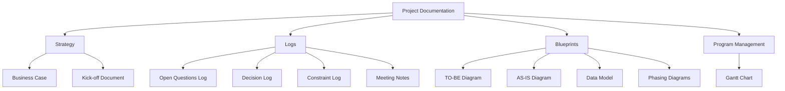
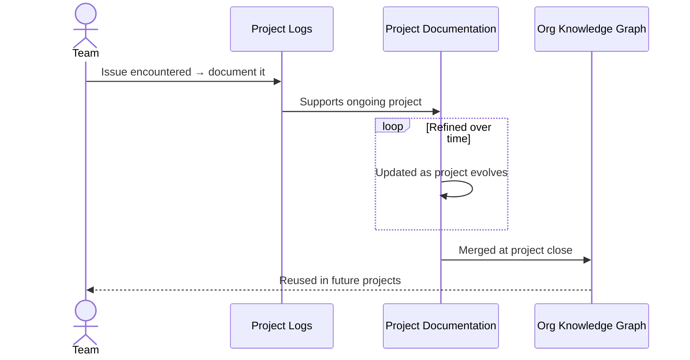

Two weeks ago I wrote an article about governance and documentation on an organisational scale. This is the follow-up post that focuses on the project scale. You could just read this post, but it's probably better that you start with [the previous one first](https://frederickvanbrabant.com/blog/2026-03-07-governance-documentation-as-a-knowledge-network/)

The biggest problem with documentation is that nobody just sits down to write it all out. And I also think that's the wrong way to go about it. You can't just give someone the task of ‘starting to write whatever needs to be written’. You will never cover the important parts. 

No, I think documentation and governance needs to start organically. You run into an issue, and you document it so the same problem doesn’t happen again. That way you know the documentation is valuable, as you've already encountered it once. 

Projects are the best starting point of this. You're doing changes to your organisation, and you need to communicate them anyway to the rest of the team. So why not store them in a central place.

## The problem with frameworks and articles like this
If you're an enterprise architect, you've probably heard of the TOGAF framework. It's one of the more well-known enterprise architecture frameworks that help you govern projects in a “mature way”.

The current TOGAF framework has a portfolio of 14 types of Catalogues, 10 types of Matrices, and 32 types of Diagrams.

I've seen projects follow TOGAF to the letter, and it became more about writing documents than working on the project.

The same is true for this article. Later on I'll show you a list of documents that you can make to support a project. It's more than you are probably doing right now.

But that's the idea with frameworks and articles like this, you pick and choose. If you are building a low-code application to order catering for lunch, please don't make 32 types of diagrams. On the other hand, if you go too lean on an SAP transformation project that takes 2–3 years, you will run into communication issues and generally won't have a great time.

You can call it Just-in-Time documentation.  You take a few base documents (more on that later) and add what you think you need for the programme you're running.

## My project toolkit
For me, there are four main areas to support a (large) project.

You require the **Strategy**, the foundation where you start and what the idea of the project is. The **Logs**, these are living documents that capture what is going on. **Blueprint**, these are mainly diagrams to support the project visually. And finally **Program Management**, where you keep everything that's related to timing and execution. 

### Strategy
All of this starts with a Business Case. The “Why” we are doing this document. This can be high level, or very deep. Again, depending on the project. This should be the same Business Case that got approved by the higher-ups to start the project.

You will also find a Kick-off document here. These are often PowerPoint slides that define the team, scope, way of working, and timelines.
### The Logs
These are very important, especially when you’re going to merge them back into the rest of the documentation. In the past I've written about [Chesterton’s Fence](https://frederickvanbrabant.com/blog/2025-07-11-chestertons-fence-and-paralysing-your-organization/), this is a good way to avoid those issues.

I always like to have an Open Questions Log. A centralized document (everyone has access) to questions that need answers. Each of the questions has an ID, a name that describes the question, a history (with dates), a priority, a person assigned, and a status. 
This makes it very easy to see what is still open and how they might impact other questions. I like to keep all of this is in one big document (An Excel sheet works, but linkable documents work better) and link every solved question to the Decision Log.

The Decision Log is where you keep track of the closed questions. Again, very handy in an ongoing project, but extra useful once the project is over and it all becomes part of the bigger documentation. Every decision can be either a small standalone document explaining the 'how' and 'why', or simply a list of outcomes. I’d also advise mentioning the alternative options and why you didn't take them. Sometimes you can't go for the optimal solution, this is a great place to tell the world why.

A Constraint Log. This could also be part of the strategy, but it's more living, so I like to put it here.  Here you can document budget, compliance, and technical constraints. This is mainly here to communicate constraints and onboard new people.

Meeting Notes are also handy to store here, probably best in a subdirectory. AI-generated documents are actually very welcome here (compared to other AI generated documentation everywhere else). Storing meeting notes in a central place can eliminate a lot of pointless discussions.
### Blueprints
I like to keep my diagrams both in the raw format (visio, draw.io, lucid,...) and in static formats (like PNG). Not everyone has diagram software, and you want this to be as accessible as possible.

Also, please add labels to your diagrams. At a minimum, the labels should include Author, Date, and Status.

I always like to have diagrams that show both the Target and AS-IS states, and if it's a big project, what the project phases look like. Again, label and version everything. Use colours and make it accessible [^1]

A data model is also handy. Especially if you're talking to people that are experts in their tooling, they tend to think in data flows rather than applications. So define what data lives where and what's the system of record.

### Project related documents
This is a bit of a catch-all section for the other documents that could be needed. 

I always like a Gantt Chart. Make sure it's up-to-date and accessible to everyone. Ideally you also have the Critical Path highlighted. Also, deadlines and gates should be present. Providing a central Gantt chart ensures that project management is democratised. You want to make sure that everyone in the project is aware of what work needs to be done when and what the impact is of not delivering certain parts on time.

## The most important ones
As I said earlier, this is a bit of a buffet. You pick and choose what you think is essential in the scope of the project. You can also add more later.

That being said I like to always have at least the core documents. Even if it's a project for an app that will be live for two weeks.

- **The Business Case:** If this isn't clear, the architecture will drift.
- **Decision & Question Logs:** These are the most valuable “historical” nodes for future maintainers.
- **TO-BE Diagram:** A quick reference for everyone on what’s actually changing. Also, easy to copy and paste into presentations for higher-ups.
- **The Gantt:** That's just basic project management and keeps everyone honest.

## Merging it back into the bigger documentation
I always find it a shame when projects simply fade out. The end of the project is, to me, always the most important part. What is actually delivered and what did we learn.

That's why I always like to have a retrospective on projects. This would fit well in the MOC[^2] of the project at the top.

This is also the moment that you can move the documents over from the project phase to the general documentation.

The diagrams can move towards the **resources** section with links to the applications.

Going over the logs, you can remove the noise and keep the logs that are relevant to processes and applications to the logs of those processes and applications.

By doing this, the project's 'Target Architecture' simply becomes the application's new 'Current State' node in your knowledge graph.

You end up moving the rest to the **archive** section as a project folder. It's very essential to not just delete here. If you have a similar project in the future, you can copy a lot of homework here.

## Organic documentation
So these are my current views on documentation. To paraphrase this article and the previous one:

Small documents that are interconnected. Accessible and owned by everyone. Organically grown and mainly written from a project perspective.

[^1]: I wrote a post about why I never use Archimate diagrams for this here: https://frederickvanbrabant.com/blog/2025-3-21-whats-the-use-of-archimate-anyway/

[^2]: Check the previous part of this article for more information if you have no idea what I'm talking about here
