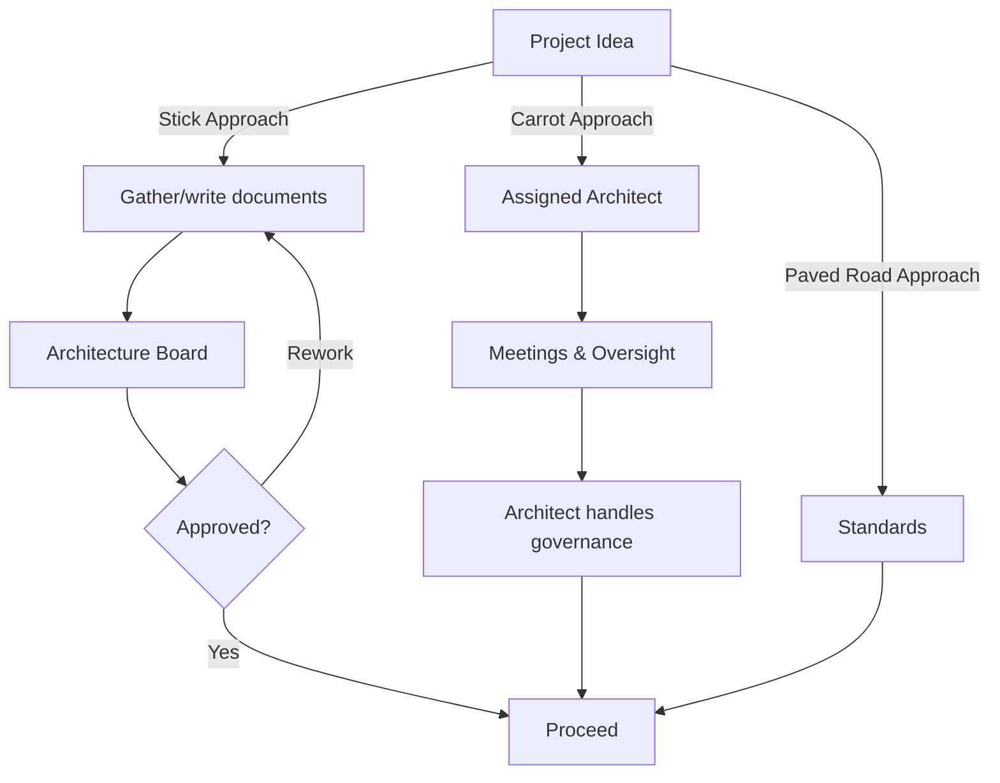

Last post I wrote about [how you can approach buy in for your architecture](https://frederickvanbrabant.com/blog/2026-04-04-whats-in-it-for-me-architecture/). I've been thinking a lot more about the topic, and would like to delve a bit deeper into it.

I still stand fully behind the post I wrote two weeks ago, but the more I think (and research) about it, the ideal situation is that you don't have to seek buy in for your architecture at all.

## The carrot and the stick

Almost all architecture offices I've seen have a policing stance. When you want to get your software, tooling, or approach implemented, you're going to need to pass through the architecture board (or some kind of board).

In these boards, there are architects that go through all the documents required (artefacts) and either approve or disapprove the setup.

I would call this the stick approach. People don't want to go through this procedure. They have to prepare all of these documents, follow all of these guidelines and after all of this work, the faceless board can still stop everything in its tracks. With rework and unclear deadlines as a result.

The reality is that most people try to avoid this entire setup and either go the shadow IT route, or try to make their new project part of an existing (and allowed) project.

An alternative to this setup is the carrot approach. This often works a lot better. Every project gets an architect appointed to it. They guide the project so it aligns to the way of working of the organization. As you can imagine, this is a lot more work for the architecture team and also results in more things the project has to keep track of.

Even if the architect takes care of all the governance and rules, you still have to have all the meetings in place. You also don't have to pass the board (or the architect takes care of all of that), but you've inherited a team member whose job is to say 'yes, but' at every turn.

## Internal customers

As architects, our customers are typically internal colleagues, so let's try to step into the shoes of our customers.

You (as a non-architect) want to pitch a project to automate a part of your teams work process. They tell you that to start doing that you need to fill in x amount of documents and present your project to a board of people you've never heard of. Yeah, I don't want to do that. I got approval from my boss that I can do the project, who are these people that I need to spend two weeks of document gathering for that can block everything.

Alternatively you get someone placed in your team that has a lot of ownership of the project and can dictate how you should handle your project. Also, not exactly ideal. More meetings, more things to keep track of, and most importantly: how will my end process even look like?

What if there is a 3rd way?

“Hey we've heard you wanted to automate some workflows. We have a standard for that. It's fully approved and brings **you** these benefits … and by the way, it also handles security, logging, and legal. So you don't have to pass there any more”.

What a dream. As a customer someone came to you and gave you not only part of your project worked out, they also took a security and legal board off your plate. This is a direct positive impact to your project timeline. Next project I'm going to seek out these people.

And what if said workflow doesn't fit? Then we adapt it, but the foundation is already there. You're not talking over process adaptations and not the base structure.

This is called paved road architecture and is used by Netflix and Spotify.

## Path of least resistance

Projects will always follow the path of least resistance, that's just project management. Try to minimize your risks and guard your scope and timelines.

Paved road architecture plays into that. If we make the easy route the “good” route, people will default to that. Everyone wins.

And more importantly is that you will automatically discourage people from not following it. If they don't follow the carved-out route, they will have to carve out their own route. That will take time and risk.

You could argue that this hinders innovation, as you are making everything uniform. But that is something that can be solved with innovation projects where you adapt and update these paved roads.

I would even argue that's the preferred way, as that also makes sure that strategy is being applied at one place, and enforced automatically.

## Architecture à la carte

An even further path here is a fully modular system where you have blocks of architecture that plug and play. That way you end up with a menu that people just select based on their needs.

If you make that “human-readable” you can have questions like: how many users do you expect to serve, how long will this application be live, do you like approach x or approach y, …

In the end you send this (or generate this) to architecture. They validate it, and you're off to the races.

The governance doesn't disappear, there is still a need for architecture to keep an eye out for what is happening. If most of your architecture relies on enforcement, you’re solving the problem too late.
