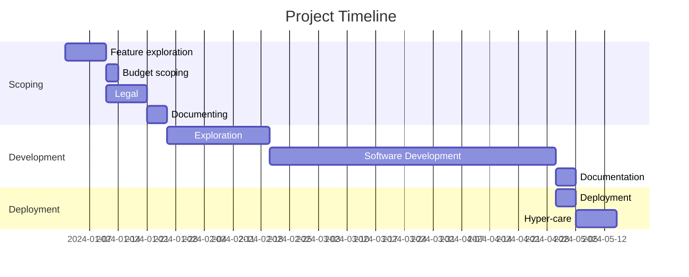
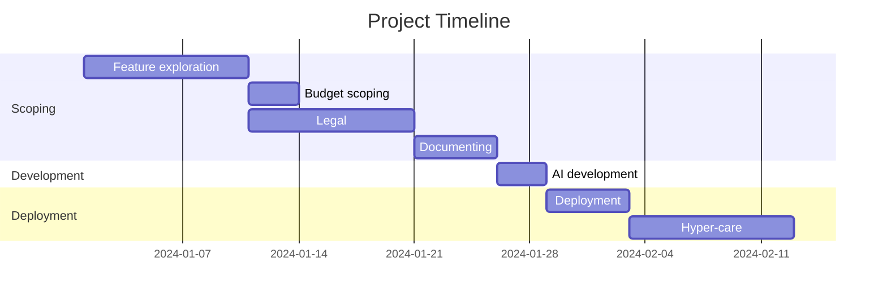
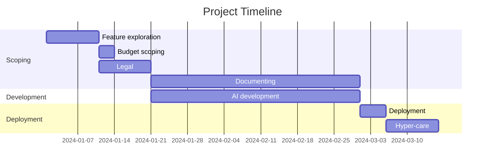

I have the feeling that every organization out there is, at least partially, focusing on process optimization, something that often happens when the market is down. These days there is also the AI angle to the entire thing, and the unrealistic expectations that follow it.

To come fully prepared for this, I've decided to re-read two absolute classics in this space: [The Toyota way](https://en.wikipedia.org/wiki/The_Toyota_Way) & [The Goal](<https://en.wikipedia.org/wiki/The_Goal_(novel)>) [^1]. I've read both of these books in college, but re-reading them made me realize that a lot of these process optimization exercises are too simplistic in nature, and often misunderstand what to focus on.

## The visual bottleneck

Let me show what I mean.

_This is a Gantt chart for demonstration purposes, normally you would look at BPMN. Showing a Gantt makes the point easier._

If you take a look at this Gantt chart you will immediately see what takes the most amount of time: software development. If your task was to improve project throughput, that would be your first stop. And that would be correct.

The problem, however, is how I typically see people go about it: throw people at the problem[^2] or just assume AI is going to make it so much faster.

What people typically don't do is look at **why** this is taking so long, and even more importantly: long duration does not automatically mean the problem originates there.

## Solving the issue upstream

We are now talking about software development, but this is applicable to all processes that take longer than you would like.

Every software developer knows that you can't make projects go faster just by typing faster. If that were the case we would all be taking typing lessons.

Software development is about translating a problem into a solution that a computer can understand and automatically resolve. Preferably in a secure and scalable way.

To do something like that, you need a full overview of the problem. Either in feature or scope documents (if you're going more waterfall), or with constant iteration with the domain experts (more agile).

This is often the part that slows down software development. Trying to figure out what a vague, title only, feature request actually means.

What does "send mail to user once sale is completed" mean? Ok, we can send a mail, but what should be in the mail? What if there was an issue in the sales process, do we still send an error mail? When is a sale completed?

## Just throw AI at it

An argument that I keep hearing about the automation of software development (AI generated code) is that you can just bypass the development part and the software developer becomes the project manager. AI discussions around software development actually illustrate this problem perfectly.

A lot of people expect the outcome of AI development to look like this:

But that's not how this works. Here we face the exact same upstream issue as before.

Yes, AI can generate code quickly (whether that's a good thing is open for debate), but that doesn't mean it's generating the correct code.

In comparisons between human vs AI development they always ignore the handholding that is needed for AI to do its thing. It looks a lot more like this:

Maybe this setup is faster compared to the old way of working. But I also think it's an unfair comparison. Working like this requires a much deeper involvement of domain and product experts. This involvement would mean writing out every feature and bug fix down to the tiniest detail.

This exact thing is what software developers have been begging for since the beginning of the profession: Receiving a detailed outline of the problem and what the end result should look like.

If you were to give human developers the same amount of feature/scope documentation you would also see your productivity skyrocket.

## Actually speeding up processes

If you want to speed up processes, you need to make sure that the people that need to do the work have all the means to actually do the work.

This means that if your legal approval process is going slow, you take a look at what is needed to start a legal approval process. If they need to chase five different people for incomplete documents, you're not going to speed up said process by adding more lawyers to the department.

One of the big lessons of The Goal is: ”bottlenecks should receive predictable, high-quality inputs”.

I think that should be the first stop in process automatization.

[^1]: The Toyota way is amazing and I would highly recommend it. The Goal is a bit of a less pleasant read, I would go for the comic version

[^2]: The Mythical Man-Month. Another classic
